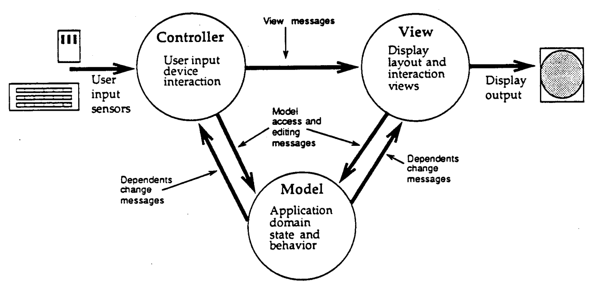
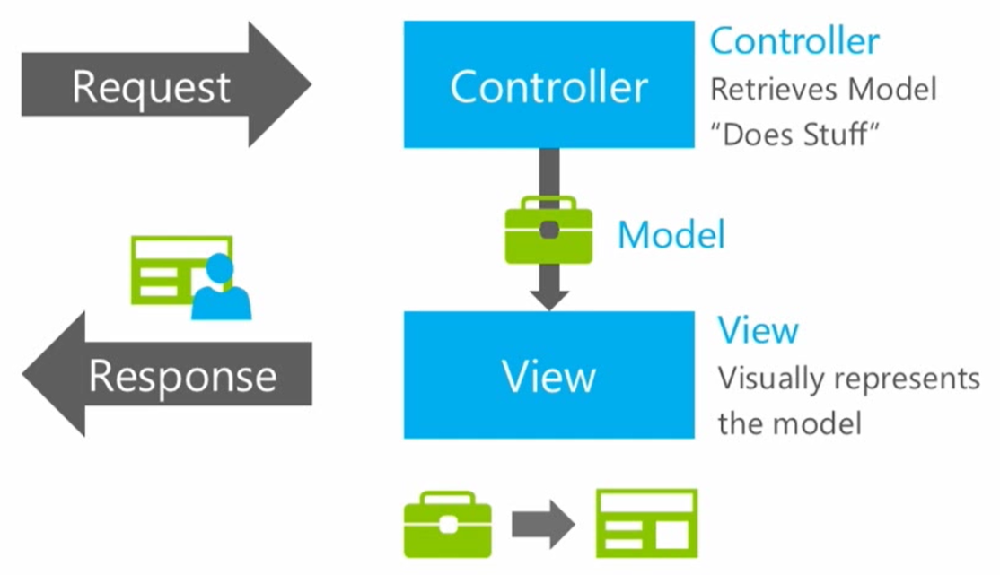
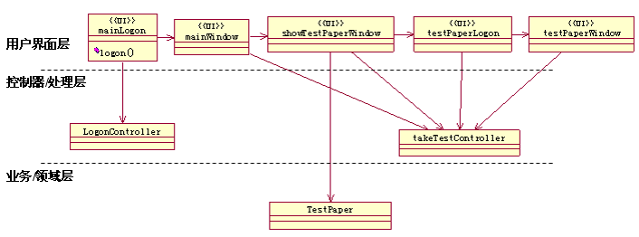
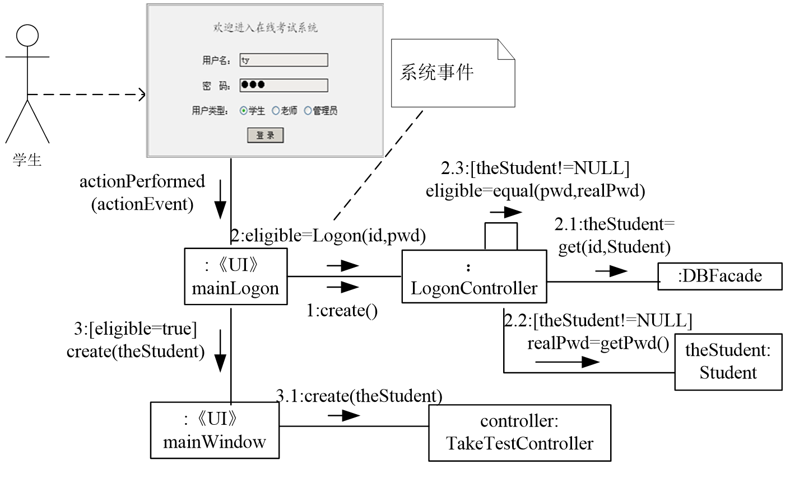

# 关于北邮教材 MVC 的思考

> 2017/6/2
>
> 郭芙在风陵渡口说过：你是大侠，我也是大侠，大侠也未免太多了吧。

[heading-numbering]

## [no-number] [toc-heading] TOC

[TOC]

## 什么是 MVC

作为面向对象架构设计的经典，MVC 现已被广泛的应用在各个领域。MVC 分成三部分：模型（Model）用于定义数据类型和数据结构，视图（View）用于定义展现出的用户界面，控制器（Controller）用于定义如何响应系统事件。[mvc-wiki]

MVC 架构模式的基本处理流程为：

- 用户（系统事件） 输入 控制器
- 控制器 操作 模型
- 模型 更新 视图
- 视图 输出给 用户

1988 年，Glenn E. Krasner 和 Stephen T. Pope 为 Smalltalk 提供了一种基于 MVC 的设计 Smalltalk-80 用户界面的方法。MVC 的提出是为了解决代码可复用性和可扩展性（Reusability and Pluggability）问题。[smalltalk-mvc]（图 [graph|smalltalk-mvc-architecture]）

[graph|&smalltalk-mvc-architecture]

[align-center]

[align-center]

图 [graph||smalltalk-mvc-architecture] - Smalltalk-80 MVC 架构 [smalltalk-mvc]

随后，由于 MVC 具有诸多优点，也被应用到了 Web 程序上，例如 ASP.NET MVC。（图 [graph|asp-net-mvc-architecture]）

[graph|&asp-net-mvc-architecture]

[align-center]

[align-center]

图 [graph||asp-net-mvc-architecture] - ASP.NET MVC 架构 [asp-net-mvc]

基于客户端和基于 Web 的 MVC 尽管在原理上是相似的，但因为 HTTP 协议的限制，他们在实现上有所不同：

- 基于客户端的 MVC 利用了 observer pattern 实现了 model 更新对 view 的通知
- 基于 Web 的 MVC 则是通过 controller 获取 model 并构造 view 再返回给用户

## 为什么要思考 MVC

因为这个学期开了一门 **软件工程** 的课，教材里的 MVC（因为是北邮教材里出现的，故简记为 **B-MVC**）和传统的 MVC 不大一样。图 [graph|b-mvc-architecture] 展示了 B-MVC 的架构，图 [graph|b-mvc-example] 展示了 B-MVC 的一个示例。

> 当然，软件工程里并没有绝对的好坏，所以这里不评判这两类 MVC 之间的优劣，只是对这两类设计的可复用性和可扩展性进行简单的分析。

[graph|&b-mvc-architecture]

[align-center]

[img=max-width:60%]

[align-center]

图 [graph||b-mvc-architecture] - B-MVC 架构图

[graph|&b-mvc-example]

[align-center]

[align-center]

图 [graph||b-mvc-example] - B-MVC 学生考试系统设计类图

### B-MVC —— 定义了四层结构的 MVC

B-MVC 架构图除了定义 MVC 之外，还定义了 用户界面层-控制器层-业务领域层-持久化层 的四层结构。除了最后一层，前三层分别对应了 MVC 里的 view、controller 和 model（而不是单纯的 service）。其中，如图 [graph|b-mvc-architecture] 所示，view 依赖于 model 和 controller，而 controller 仅依赖于 model（不依赖于 view）。

尽管四层的架构模式非常优美，但它并不需要和 MVC 绑定在一起。😂 因为 MVC 不一定按照这样的 n-层架构 进行设计。

### B-MVC —— 不完全解耦的 MVC

相比于传统的 MV (model-view) 模型，MVC 以 model 为核心，具有很好的可复用性和可扩展性：

- 解耦 view 和 model：可以使用不同的 view 展现同一个 model
  - 例如，饼形图、柱状图、表格展示同一份统计数据
- 解耦 view 和 controller：
  - 可以让 同一个 view 实现不同的系统事件响应（使用 factory method pattern 构造 controller）；例如，同一个登录界面可以使用 QQ、微信、原生的认证方式
  - 可以让 同一套系统响应的业务逻辑用于不同的 view；例如，饼形图、柱状图、表格可以共用一份系统事件的响应逻辑

[graph|&b-mvc-process]

[align-center]

[align-center]

图 [graph||b-mvc-process] - B-MVC 学生考试系统的一个流程

与 MVC 不同，B-MVC 以 view 为核心：由 view 接受系统事件，然后传递给 controller，controller 构造 model 并传递给 view 用于显示；当界面导航时，由前一个 view 构造后一个 view（而不是 controller）。（如图 [graph|b-mvc-process] 所示）

基于这种 view 为核心的设计：

- 解耦 view 和 model：尽管会带来 view 上业务处理的冗余，但这没问题
- 不能解耦 view 和 controller：
  - view 根据用户对界面的操作，选择 controller 的操作（而不是将 action 绑定到 controller 上；图 [graph|b-mvc-process] 中的 `1:create(); 2:eligible=Logon(id, pwd)`）
  - 再对 controller 的返回结果进一步处理（而不是将所有的系统事件的响应逻辑写在 controller 上；图 [graph|b-mvc-process] 中的 `3:[eligible=true]`）
  - 最后 view 更新自身的内容（view 高度自治；图 [graph|b-mvc-process] 中的 `3:create(theStudent)`）
- 当业务需要扩展的时候：
  - 如果需要增加新的 **同类** 页面，新增的 view 需要重写 view 内部的逻辑（尽管相同），带大量冗余
  - 如果需要增加新的 **同类** 系统事件响应逻辑，需要修改 view 内部的代码，构造不同的 controller（图 [graph|b-mvc-process] 中的 `1:create()`）

### 界面循环依赖

图 [graph|b-mvc-example] 中的界面都是单向依赖，但是需要设计复杂的界面的时候，B-MVC 可能会出现界面的循环依赖的问题。如果说 **适当的冗余可以接受**，那么出现循环依赖时，冗余就会导致代码的难以维护。

#### 简单的循环依赖

例如，程序有两个界面：一个是主界面，一个是功能 A 界面。主界面选择 _功能 A_，跳转到功能 A 界面；功能 A 界面选择 _返回_，跳转到主界面。根据图 [graph|b-mvc-example] 的方法，两个界面的依赖关系如图 [graph|cycle-view]。

[graph|&cycle-view]

[align-center]

[align-center]

图 [graph||cycle-view] - 简单的界面循环依赖

<!--
[Function A View]back ->[Main View]
[Main View]select function A ->[Function A View]
-->

#### 复杂的循环依赖

对于简单的界面，循环依赖不过是很容易解决的问题；但是当界面变得复杂的时候，界面的循环依赖会变得难以维护。

例如，图 [graph|cycle-view] 所示的界面需要增加认证的功能：选择功能 A 之后，如果用户没有登录，就需要跳转到登录页面，登录成功后再跳转到功能 A 的页面；如果已登录，就可以直接进入功能 A 的页面。另外，在功能 A 页面注销可以回到登录页面，登录页面可以返回主界面。界面之间的依赖关系如图 [graph|cycle-view-complicated]。

[graph|&cycle-view-complicated]

[align-center]

[align-center]

图 [graph||cycle-view-complicated] - 复杂的循环依赖

<!--
[Function A View]back ->[Main View]
[Auth View]login ->[Function A View]
[Function A View]logout ->[Auth View]
[Auth View]back ->[Main View]
[Main View]login already ->[Function A View]
[Main View]has not login ->[Auth View]
-->

这时候，对已有项目的 view 进行升级：

- 添加 Auth View，实现 login 和 back 的内部逻辑（符合开闭原则）
- 修改 Main View 内部逻辑，判断是否登录并处理不同的导航（不符合开闭原则）
- 修改 Function A View 内部逻辑，支持注销（不符合开闭原则）

另外，还需要对项目的 controller 进行升级：

- 添加 Auth Controller
  - 用于 Auth View 的登录操作
  - 用于 Main View 的是否登录的判断
  - 用于 Function A View 的注销操作

如果需要两套不一样的主界面（例如，图形界面和命令行），或者需要两套不一样的登录逻辑（例如，QQ 登录和微信登录），如 [sec|B-MVC —— 不完全解耦的 MVC] 所述，代码的冗余随着登录业务的复杂化，更快的膨胀了。

## 更好的设计

为了解决 B-MVC 存在的诸多问题，参考了 C# 的 WPF 技术，设计了一种基于 View Manager（视图管理器）的 MVC 架构模式。核心思想是：

- 引入 View Manager，避免 controller 直接依赖于 view
- 为 view 上的系统事件定义回调函数，用户输入时，调用回调函数
- 通过依赖注入，将 controller 的系统事件响应函数绑定到具体的 view 上

[graph|&view-manager]

[align-center]

[img=max-width:80%]

[align-center]

图 [graph||view-manager] - 基于视图管理器的 MVC

对于图 [graph|cycle-view] 的例子，我们可以构造出图 [graph|view-manager] 的类图。具体流程是：

- view manager 的 `To*View` 函数构造 view 并将 controller 的函数绑定到 view 的回调函数上
- 用户在 view 上输入时，调用绑定的回调函数（controller）
- controller 处理系统事件，操作 view manager 实现页面的更新

当业务增加的时候，我们可以把图 [graph|view-manager] 扩展到图 [graph|view-manager-complicated]，并符合开闭原则：

- 添加 View Manager 的 `ToAuthView` 函数
- 添加 Auth View，包含系统事件 `OnLogin` 和 `OnBack` 的回调函数
- 添加 Auth Controller，包含三个系统事件的处理函数
- 将原来 Nav Controller 的 `FnA` 的绑定，修改为 Auth Controller 的 `CheckLogin` 的绑定 —— 实现检测是否登录的逻辑
- 添加 Function A View 的 `OnLogout` 的绑定

[graph|&view-manager-complicated]

[align-center]

[align-center]

图 [graph||view-manager-complicated] - 基于视图管理器的 MVC 的可扩展性

## 总结

## 参考文献 [no-number]

- [mvc-wiki]: Model–view–controller. Wikipedia. https://en.wikipedia.org/wiki/Model%E2%80%93view%E2%80%93controller
- [smalltalk-mvc]: Glenn E. Krasner, Stephen T. Pope. A cookbook for using the model–view controller user interface paradigm in Smalltalk-80. The Journal of Object Technology. 1988
- [asp-net-mvc]: Introduction to ASP.NET MVC. Microsoft Virtual Academy. https://mva.microsoft.com/en-US/training-courses/introduction-to-asp-net-mvc-8322