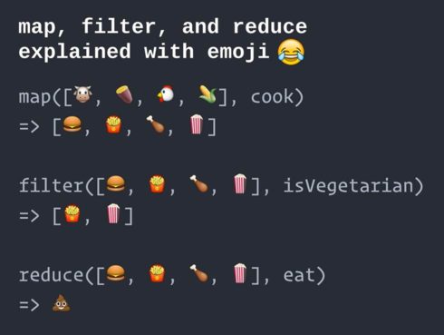

# Python 风格的函数式

> 2019/11/23
> 
> Readability counts. —— The Zen of Python, by Tim Peters (`import this`)

由于 现代编程语言 常常相互借鉴（例如 几乎所有语言都支持了 lambda 表达式/匿名函数/闭包），许多人会说：

> 学什么编程语言都一样，会一种就行。

但我 **不赞同** 这个观点 —— 我认为：用不同的语言写代码，就应该 “入乡随俗”，多领会各种语言的 **设计的艺术**。

> 三人行，必有我师焉；择其善者而从之，其不善者而改之。——《论语‧述而》

Python 为了提高 **可读性** _(readability)_，提供了很多 **语法糖** _(syntactic sugar)_，开创了别具一格的 **Python 风格** _(Pythonic)_ 的 **函数式编程** _(functional programming)_。

> 本文提到的所有概念 均可参考文中的 **链接**。😉

[TOC]

## 什么是 Pythonic (TL;DR)

举个例子，实现一个简单的需求：

- 按行打印 **当前脚本** 内容
- 去掉每行 **右侧空字符**
- 过滤所有 **空行**（去掉右侧空字符后）
- 打印时加上 **行号**（不包括空行）

**学习 Python 前**，凭感觉会这么写：

``` python
file = open(__file__)
try:
    index = 1
    while True:
        line = file.readline()
        if not line:
            break

        strip_line = line.rstrip()
        if len(strip_line) != 0:
            print('{:2}: {}'.format(index, strip_line))
            index += 1
finally:
    file.close()
```

**学习 Python 后**，只需要 3 行代码：

``` python
with open(__file__) as file:
    for index, line in enumerate(filter(len, map(str.rstrip, file)), 1):
        print(f'{index}: {line}')
```

- **异常安全** _(exception safe)_ 的打开/关闭文件
  - 前：将 `close()` 写在 [`finally` 语句](https://docs.python.org/3/reference/compound_stmts.html#the-try-statement) 内，避免异常时泄露
  - 后：使用 [`with` 语句](https://docs.python.org/3/reference/compound_stmts.html#the-with-statement)（类似 [C++ 的 **资源获取即初始化** _(Resource Acquisition Is Initialization, RAII)_](https://en.cppreference.com/w/cpp/language/raii) 思想）
- **迭代** _(iterate)_ 读取脚本 文件的每一行
  - 前：使用 `while` 循环调用 `readline()` 函数，直到读到 `None` 时结束
  - 后：使用 `for` 循环遍历 [**迭代器** _(iterator)_](https://docs.python.org/3/howto/functional.html#iterators) 获取结果
- 去掉空字符、过滤空行
  - 前：使用临时变量存储每行 `rstrip()` 的结果，使用 `if` 判断 `len()` 是否为空
  - 后：使用高阶函数 [`map()`](https://docs.python.org/3/library/functions.html#map)/[`filter()`](https://docs.python.org/3/library/functions.html#filter) 消除循环和临时变量（[参考](../2018/Higher-Order-Functions.md)）
- 记录行号
  - 前：使用自增的临时变量存储（如果少一个缩进，就会导致结果错误）
  - 后：使用 [`enumerate()` 函数](https://docs.python.org/3/library/functions.html#enumerate) 从 `1` 开始生成下标
- 格式化输出
  - 前：使用常规的 [`format()` 函数](https://docs.python.org/3/library/stdtypes.html#str.format)
  - 后：使用 [f-string _(formatted string literal)_](https://docs.python.org/3/reference/lexical_analysis.html#f-strings) 化简

所以，什么是 Pythonic —— 用代码描述 **做什么** _(what-to-do)_，而不是 **怎么做** _(how-to-do)_ —— 提升可读性。

## 迭代器

什么是 [**迭代器** _(iterator)_](https://docs.python.org/3/library/stdtypes.html#iterator-types) —— 用于 **遍历容器中元素** 的对象，需要支持 [`next()`](https://docs.python.org/3/library/functions.html#next) 操作，每次返回一个值（类似于 [C++ 的 **输入迭代器** _(input iterator)_](https://en.cppreference.com/w/cpp/named_req/InputIterator)）：

- 如果仍有元素，返回当前值（迭代器对象实现 [`__next__()` 函数](https://docs.python.org/3/library/stdtypes.html#iterator.__next__)）
- 如果迭代结束，抛出 [`StopIteration` 异常](https://docs.python.org/3/library/exceptions.html#StopIteration)（[`for` 语句](https://docs.python.org/3/reference/compound_stmts.html#the-for-statement) 迭代时处理）

例如，迭代器是 **`for` 循环** 的基础：

``` python
for i in [1, 2, 3]:
    print(i)
```

可以用 **`while` 循环** 等效实现为：

``` python
it = iter([1, 2, 3])
while True:
    try:
        i = next(it)
        print(i)
    except StopIteration:
        break
```

Python 提出了 [可迭代对象](https://docs.python.org/3/glossary.html#term-iterable) 的概念，要求 `it == iter(it)`（即 “迭代器的迭代器 返回本身”）。

## 高阶函数

然而 **普通迭代器** 只能遍历容器的 **已有元素**；但在多数情况下，需要遍历并修改 **原始元素**，构造出 **新的元素**。

在命令式编程中，常用 `for` 循环遍历已有元素，并用 临时变量 存储修改后的结果；而函数式编程中，常用 [**高阶函数** _(higher-order function)_](https://en.wikipedia.org/wiki/Higher-order_function) 消除循环和临时变量（[具体方法参考](../2018/Higher-Order-Functions.md)）：

``` python
map(str.upper, ['aaa', 'bbb'])
# ['AAA', 'BBB']

filter(lambda x: x % 2, range(10))
# [1, 3, 5, 7, 9]

reduce(lambda d, s: dict(d, **{s: s.upper()}), ['aaa', 'bbb'], {})
# {'aaa': 'AAA', 'bbb': 'BBB'}  (Trick: construct dict)
```

> 注：
> 
> - 上述代码仅用于 Python 2（原因见下文）
> - Python 3 [移除了 `reduce` 内置函数](https://docs.python.org/3.0/whatsnew/3.0.html#builtins)，并放入 [`functools.reduce()`](https://docs.python.org/3/library/functools.html#functools.reduce)

[align-center]

[img=max-width:80%]

[](http://modernescpp.com/index.php/higher-order-functions)

## 生成器

在 Python 2 中，高阶函数 [`map()`](https://docs.python.org/2/library/functions.html#map)/[`filter()`](https://docs.python.org/2/library/functions.html#filter) 以及 [`zip()`](https://docs.python.org/2/library/functions.html#zip)/[`range()`](https://docs.python.org/2/library/functions.html#range) 会直接返回 [`list` 列表类型](https://docs.python.org/3/library/stdtypes.html#lists) 的结果，会导致两个问题。

一方面，**无用计算** 会带来的 **额外开销**：

- 例如，设计一个读取数据库的函数（表中有 1,000,000 行数据）
- 假设该函数 [`return cursor.fetchall()`](https://dev.mysql.com/doc/connector-python/en/connector-python-api-mysqlcursor-fetchall.html) 一次性返回所有数据
- 然而使用者 并不总是 需要 整个列表 的数据，取出不需要的部分 会造成浪费

``` python
def get_data():
    # ...
    return cursor.fetchall()

data = get_data()
# <list of 1,000,000 rows>
```

另一方面，**不支持** 表示 **无穷的** _(potential infinite)_ 数据结构：

- 例如，表示一个从 0 到 [`sys.maxint`](https://docs.python.org/2/library/sys.html#sys.maxint) 的范围 `range(sys.maxint)`
- Python 2 中 [`range()`](https://docs.python.org/2/library/functions.html#range) 返回一个 **很长的列表**，占用大量内存
- Python 3 [移除了 `sys.maxint`](https://docs.python.org/3.0/whatsnew/3.0.html#integers)，允许使用无限大数值，而 **无限长的列表** 无法在内存里存储

``` python
range(sys.maxint)
# MemoryError
```

在函数式编程中，常用 [**惰性求值** _(lazy evaluation)_](https://en.wikipedia.org/wiki/Lazy_evaluation) 的方法解决上述问题。

什么是 [**生成器** _(generator)_](https://docs.python.org/3/library/stdtypes.html#generator-types) —— 带有 [`yield` 表达式](https://docs.python.org/3/reference/expressions.html#yield-expressions) 的函数，对外支持和迭代器相同的 `next()` 接口，按需 生成并返回结果，从而实现 惰性求值：

- 对于读取数据库的函数，可以将 [`return`](https://docs.python.org/3/reference/simple_stmts.html#the-return-statement) 改为 [`yield`](https://docs.python.org/3/reference/simple_stmts.html#the-yield-statement)，通过 [`yield cursor.fetchone()`](https://dev.mysql.com/doc/connector-python/en/connector-python-api-mysqlcursor-fetchone.html) 逐个返回结果

``` python
def get_data():
    # ...
    yield cursor.fetchone()

for row in get_data():
    print(row)
```

- Python 2 额外支持了 [`itertools.imap()`](https://docs.python.org/2/library/itertools.html#itertools.imap)/[`itertools.ifilter()`](https://docs.python.org/2/library/itertools.html#itertools.ifilter)/[`itertools.izip()`](https://docs.python.org/2/library/itertools.html#itertools.izip)/[`xrange()`](https://docs.python.org/2/library/functions.html#xrange) 用于替换内置函数：返回迭代器，而不是列表
- Python 3 直接修改了 [`map()`](https://docs.python.org/3/library/functions.html#map)/[`filter()`](https://docs.python.org/3/library/functions.html#filter)/[`zip()`](https://docs.python.org/3/library/functions.html#zip)/[`range()`](https://docs.python.org/3/library/functions.html#func-range) 等内置函数：[返回迭代器，而不是列表](https://docs.python.org/3.0/whatsnew/3.0.html#views-and-iterators-instead-of-lists)（替换了 `itertools.i*()`/`xrange()` 函数）

``` python
range(sys.maxsize)
# range(0, 9223372036854775807)

list(range(sys.maxsize))
# [0, 1, 2, ...] (MemoryError)

zip(*[[1, 2], [3, 4], [5, 6]])
# <zip object at 0x000001F9BCD2AB88>

list(zip(*[[1, 2], [3, 4], [5, 6]]))
# [(1, 3, 5), (2, 4, 6)]  (Trick: matrix transpose)
```

- Python 还提供了 [`itertools.count()`](https://docs.python.org/3/library/itertools.html#itertools.count)/[`itertools.cycle()`](https://docs.python.org/3/library/itertools.html#itertools.cycle)/[`itertools.repeat()`](https://docs.python.org/3/library/itertools.html#itertools.repeat) **无穷迭代器** _(infinite iterator)_

``` python
dict(zip(itertools.count(), ['a', 'b', 'c']))
# {0: 'a', 1: 'b', 2: 'c'}  (Trick: enumerate)

list(itertools.repeat('{}', 3))
# ['{}', '{}', '{}']  (Trick: sequence repetition)
#   ['{}'] * 3 == ['{}', '{}', '{}']
#    '{}'  * 3 ==      '{}{}{}'
```

## 推导式

- https://docs.python.org/3/howto/functional.html#generator-expressions-and-list-comprehensions

``` python
[s.upper() for s in ['aaa', 'bbb']]
[x for x in range(10) if x % 2]
{s: s.upper() for s in ['aaa', 'bbb']}

{s.upper() for s in ['aaa', 'bbb']}
```

- https://treyhunner.com/2015/12/python-list-comprehensions-now-in-color/
- https://docs.python.org/3/tutorial/datastructures.html#list-comprehensions

### 高阶函数 vs 推导式

- https://docs.python.org/3/library/itertools.html#itertools.product

``` python
product = itertools.product
list(filter(lambda t: t[0] < t[1] and t[0] ** 2 + t[1] ** 2 == t[2] ** 2,
            product(range(1, 100), repeat=3)))
```

- https://docs.python.org/3/library/itertools.html#itertools.chain

``` python
flatten = itertools.chain.from_iterable
list(filter(
    lambda t: t[0] ** 2 + t[1] ** 2 == t[2] ** 2,
    flatten(map(lambda z:
                flatten(map(lambda x:
                            map(lambda y: (x, y, z),
                                range(x, z + 1)),
                            range(1, z + 1))),
                range(1, 100)))))
```

- https://docs.python.org/3/tutorial/datastructures.html#nested-list-comprehensions

``` python
[(x, y, z) for z in range(1, 100)
           for x in range(1, z + 1)
           for y in range(x, z + 1)
           if x ** 2 + y ** 2 == z ** 2]
```

不要滥用：

- https://treyhunner.com/2019/03/abusing-and-overusing-list-comprehensions-in-python/

## 其他技巧

- https://docs.python.org/3/tutorial/datastructures.html#looping-techniques
- https://docs.python.org/3/tutorial/datastructures.html#more-on-conditions
- https://docs.python.org/3/howto/functional.html#the-itertools-module
- https://docs.python.org/3/howto/functional.html#the-functools-module

## 最后聊聊 Python 这个语言

虽然 Python 的可读性不错，但可写性并不好（对于 **其他语言用户** 不太友好；仁者见仁，智者见智）：

- `len(LIST)` 而不是 `LIST.length()`（参考：[Why does Python use methods for some functionality (e.g. list.index()) but functions for other (e.g. len(list))? | Design and History FAQ](https://docs.python.org/3/faq/design.html#why-does-python-use-methods-for-some-functionality-e-g-list-index-but-functions-for-other-e-g-len-list)）
- `STR.join(LIST)` 而不是 `LIST.join(STR)`（但 `LIST.split(STR)` 却是有的，参考：[Why is join() a string method instead of a list or tuple method? | Design and History FAQ](https://docs.python.org/3/faq/design.html#why-is-join-a-string-method-instead-of-a-list-or-tuple-method)）
- `COND ? EXPR1 : EXPR2` 运算符 写为 `EXPR1 if COND else EXPR`（参考：[Is there an equivalent of C’s “?:” ternary operator? | Programming FAQ](https://docs.python.org/3/faq/programming.html#is-there-an-equivalent-of-c-s-ternary-operator)）

作为一个 **非脚本语言用户**，离开了 **编译器的检查** 和 IDE 强大的 **智能提示**，感觉自己不会写代码了：

- 由于 Python 是 **运行时强类型** 语言（参考：[Strong versus Weak Typing
_(A Conversation with Guido van Rossum)_](https://www.artima.com/intv/strongweak.html#part2)）
- 只有在 **运行时**，才能发现函数调用的参数（个数/类型）错误
- 由于使用的是 Python 2，函数不能指定 参数/返回值 的类型，VSCode **智能提示** 经常失效

尽管如此，Python 的 **核心语言** _(core language)_ 还算比较简单，很多概念都是 **良好定义** _(well-defined)_ 的；所以只要理解了基本原理，还是能很快排查各种错误的。

优雅 _(elegant)_

由于写本文时我的 Python 代码量不超过 1k 行，所以 如果有什么问题，**欢迎交流**。😄

Delivered under MIT License &copy; 2019, BOT Man
